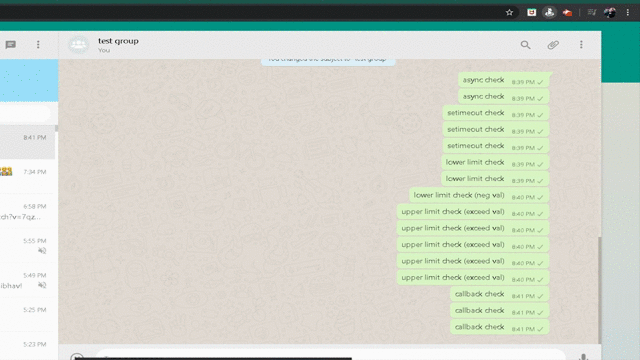

# whatsapp-spam-chrome-extension (WSCE)
A simple Chrome extension to spam your friends or group with repetitive messages.

 [](https://discordapp.com/users/228556195689005059) [](https://www.linkedin.com/in/akashpawara)
 
 

This is the first Version of the extension for Whatsapp. In this Version you can type a message and spam it to the selected chat (could be a contact or a group) how often you want. The cool thing about this extension is that the UI is binded to the Whatsapp Web UI.

## :warning: NOTE :warning:
This application is for private or educational purposes only. Do not use it on other people without their permission. I do not accept responsibility for banned accounts or penalties of any kind caused by the use of this bot. I would like to point out that using a bot violates the Terms and Conditions of Whatsapp. By using the bot, you automatically accept that you yourself are criminally responsible for yourself and you are aware that it violates the guidelines.

## Table of Contents

* [Quick Start](#quick-start)
* [File Structure](#file-structure)
* [Technical Support or Questions](#technical-support-or-questions)
* [Social Media](#social-media)

## Quick start
### Git-Clone
- Clone the Project: `$ git clone https://github.com/akashpawara/college-fest-landing-page.git`.
- Either clone it using above command or simply download zip & extract to your desired directory.
### Installation
- Open Chrome => Go to settings => Extension => Toggle Developer mode on => Click on Load unpacked => select the cloned directory.
`Poof You have Succefully installed this extension!`:smile:
### How-To-Use
- Open Whatsapp web.
- Select a contact or a group to whom you like to spam.
- Open extension => Input your message & count => Click send
`Poof you just spammed someone!`:smile:

:warning: DO NOT INSERT MORE THEN 200 TIMES BECAUSE MOST OF THE TIME YOUR BROWSER WILL CRASH  
:heavy_check_mark: Lucky for you guys I have kept the limit to 200. :smirk:

## File Structure
Within the download you'll find the following directories and files:

```
whastapp-spam-chrome-extension/
├── README.md
├── assets
│   ├── css
│   │   └── popup.css
│   ├── js
│   │   ├── background.js
│   │   ├── inject.js
│   │   └── popup.js
│   └── icons
│       ├── icon.png
│       └── whatSpam.gif
├── popup.html
└── manifest.json

```

## Technical Support or Questions

If you have questions or need help integrating the product, [contact me](https://api.whatsapp.com/send?phone=917506021898) me on whatsapp or email me at (akashpawara29@gmail.com).


## Social Media

Linkedin: <https://www.linkedin.com/in/akashpawara>

Medium: <https://medium.com/@akashpawara>

Dev: <https://dev.to/akashpawara>

Behance: <https://www.behance.net/akashpawara>

Instagram: <https://instagram.com/akash_pawara_>

Whatsapp: <https://api.whatsapp.com/send?phone=917506021898>